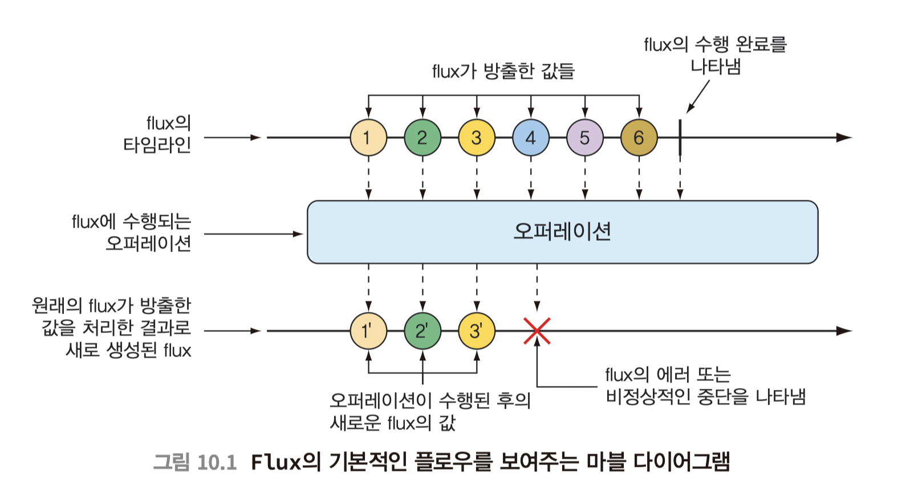
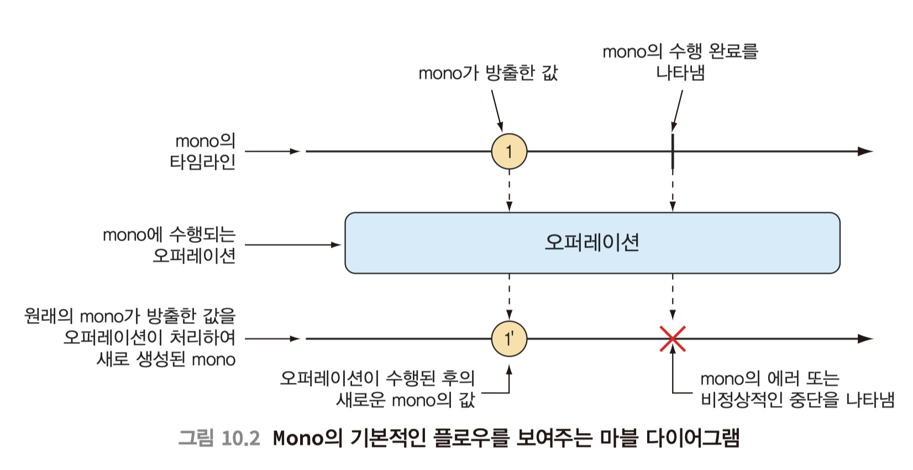

## Reactive-Programming (반응형 프로그래밍)

### 참고 
WebClient Spring 공식문서 :https://docs.spring.io/spring-framework/docs/current/reference/html/web-reactive.html#webflux-client 
mono flux 개념 :https://github.com/gngsn/Gngsn-Spring-Lab/blob/master/note/Reactor.md 
토비의 Spring Web Flux : https://www.youtube.com/watch?v=2E_1yb8iLKk 
webflux 가 생긴 이유 : https://heeyeah.github.io/spring/2020-02-29-web-flux/ 
reactor core github : https://github.com/reactor/reactor-core 
내가 만든 WebFlux 가 느렸던 이유 : https://www.youtube.com/watch?v=I0zMm6wIbRI 
Reactor 예제 : https://tech.kakao.com/2018/05/29/reactor-programming/ 
리액티브 프로그래밍 : https://wecandev.tistory.com/60 

### 비동기 프로그래밍 4가지 핵심원칙
1. Responsive(응답성): 사용자의 요청에 대해 즉각적으로 응답, 신속하고 빠른 응답시간으 일관된 서비스 품질
2. Resilient(복원력): 장애가 발생해도 시스템은 계속해서 동작
   - 탄력성은 복제(replication), 봉쇄(containment), 격리(isolation), 위임(delegation)에 의해서 이루어진다.
   - 장애는 각 컴포넌트 내부로 억제돼 각 컴포넌트들을 서로 격리시키고, 그래서 하나의 컴포넌트에 장애가 발생하더라도 전체 시스템에 영향을 끼치지 못하게 된다.
3. Elastic(유연성): 시스템의 부하가 증가하면 자동으로 확장
   - 중앙집중적인 방식을 사용하지 않고, 병목현상 없게 설계되어야 한다.
   - 시스템을 샤딩, 복제 하여 INPUT 을 분산시킨다. 
4. Message-Driven(메세지 기반): 비동기 메시지 전달을 통해 컴포넌트간 통신

<b> -> 즉 가능한 즉각적 응답이 핵심</b> 장애발생시 응답성유지, 작업량 변화에도 응답성 유지가 핵심.
-> Message-Driven, 비동기 Non-Blocking 기반의 프로그래밍(Message Queue)을 사용하는 방식이다

* Back-Pressure(배압): 시스템이 데이터를 처리하는 속도를 조절하는 매커니즘
  * 데이터의 생산자(producer), 소비자(consumer) 간의 데이터를 주고받을때
  * 데이터를 생산하는 속도가 데이터를 소비하는 속도보다 빠를때, 데이터를 버퍼링하거나 데이터를 소비하는 속도를 늦추는 방법
  * -> 즉 시스템 과부하를 방지하고, 데이터를 처리하는 속도를 조절하는 방법
  * Reactive Stream 스펙에서 명시되어있는 설명
    * -> reactive-stream 의 목적은 non-blocking back-pressure 를 이용하여 비동시 스트림 처리의 표준을 제공하는것.
  * 주요 방식: 버퍼링(소비자는 데이터를 버퍼에 저장하고 나중에 처리), 데이터버리기, 속도조절(소비자가 요청한 때만 데이터를 제공)

* Spring WebFlux 는 netty 를 내장서버로 사용하고 있다.(default)

---
#### Spring MVC 를 사용했을때 문제점
Spring MVC Limitations: Spring MVC 에 내장된 Tomcat의 기본 Thread pool Size 는 "200" 이다. 
동시성은 "200" 까지만 처리할수 있다 (제한됨)
-> size 를 늘릴수 있긴하지만, 임시방편 방법이다.
-> 기술이 발전함에 따라, 더 많은, 효율적인 방법을 필요로함. -> 동시접수자수의 증가

Thread 는 비용 비싼 자원이다. -> heap 사이즈를 1mb 이상으로 쉽게 차지할 수 있다
즉, Thread 를 많이 생성하면, 메모리를 많이 차지하게 된다. 다른 요청을 처리하기 위한 공간이 줄어듬(앱의 성능 저하)
-> 더 많은 동시 사용자를 다루는데 한계가 존재함.(api 가 생성되게 될시)

* Restful 앱의 대기시간 = DB 대기시간 + API 대기시간 + 외부 서비스 대기시간 + 기타 대기시간
  * 이러한 시간을 줄이기 위해 "병렬" 처리를 함으로써 응답(대기)시간을 줄일 수 있음.
  * Callbacks, Futures 로 처리(Java)
    * 다만, 원하는 결과를 얻기위해 다중기능을 결합하는것은 쉬운일이 아님.
* 다만, Spring MVC 에서 API 를 최적화 한다고 해도, 동시성을 처리하는데에는 한계가 있음
  * 또한, Server Level 에서는 여전히 Thread 가 차단되어, 처리하는데 어려움

--- 
#### Reactive Programming 사용예시
* 높은 부하를 처리하는 앱을 개발 할때 사용함 
1. 실시간 데이터 스트리밍 서비스(WebSockets 메시징시스템, 소셜 미디어 피드, IoT)
2. 비동기 REST API 서버 
3. 대규모 파일 업로드 및 다운로드 서비스
4. MSA
5. 소셜 미디어 피드 서비스

--- 

## Reactive Streams
* Reactive Streams 는 비동기 스트림 처리를 위한 표준 스펙
* 반응형 프로그래밍의 기반
* 4개의 기본 인터페이스가 있음
  1. Publisher(게시자): 데이터를 발행하는 역할
  2. Subscriber(구독자): 데이터를 구독하는 역할
  3. Subscription(구독): Publisher 와 Subscriber 사이의 연결고리
  4. Processor: Publisher 와 Subscriber 를 모두 상속받는 인터페이스

> Reactive Stream Events : onNext, onError, onComplete
>> onNext: 데이터를 발행하는 이벤트  
>> onError: 에러가 발생했을때 이벤트 
>> onComplete: 데이터 발행이 완료되었을때 이벤트  
>> 일반적으로 데이터요청 -> 확인응답 -> 요청데이터 -> 응답데이터(n) -> 완료시(onComplete() 로 응답 및 종료) 시퀀스로 이루어짐.

---

## Spring WebFlux
WebFlux가 생긴 이유는,
(1) 적은 양의 스레드와 최소한의 하드웨어 자원으로 동시성을 핸들링하기 위해 만들어졌다. 서블릿 3.1이 논블로킹을 지원하지만, 일부분이다. 이는 새로운 공통 API가 생긴 이유가 됐으며, netty와 같은 잘 만들어진 async, non-blocking 서버를 사용한다.
* Spring WebFlux 는 Spring 5 부터 추가된 모듈
* Spring WebFlux 는 Non-Blocking, Reactive RestFul API 를 개발할 수 있게 해줌
 
* Spring Boot 를 이용해 WebFlux 앱을 만들때, 내장서버(netty)가 생성되고
netty 는 Non-Blocking I/O 를 지원함(처리함)
 

* 내부적으로 Reactor 라이브러리를 사용함

#### Reactor(Project Reactor)
* Reactor 는 Reactive Streams 를 구현한 라이브러리
* Flux, Mono 두가지 타입을 제공, 각각  reactor-core 모듈의 일부(class)
  * Flux: 0~N 개의 데이터를 처리할때 사용
  * Mono: 0~1 개의 데이터를 처리할때 사용
* !!다만 여러개의 Stream 을 하나로 모아서 처리할때 Mono, 각각의 Mono를 합쳐서 여러개의 값을 여러개의 결과로 처리하는 Flux 로 표현도 가능함

--- 
#### Flux 흐름

 

#### Mono 흐름

 

** 여기서 오퍼레이션은 수행되는 어떠한 작업을 한다는 의미이며  
Mono, Flux 는 500개 이상의 오퍼레이션이 존재함, 오퍼레이션은 다음과 같이 분류 가능하다.
* 생성 오퍼레이션 creation operation
* 조합 오퍼레이션 combination operation
* 변환 오퍼레이션 transformation operation
* 로직 오퍼레이션 logic operation

---